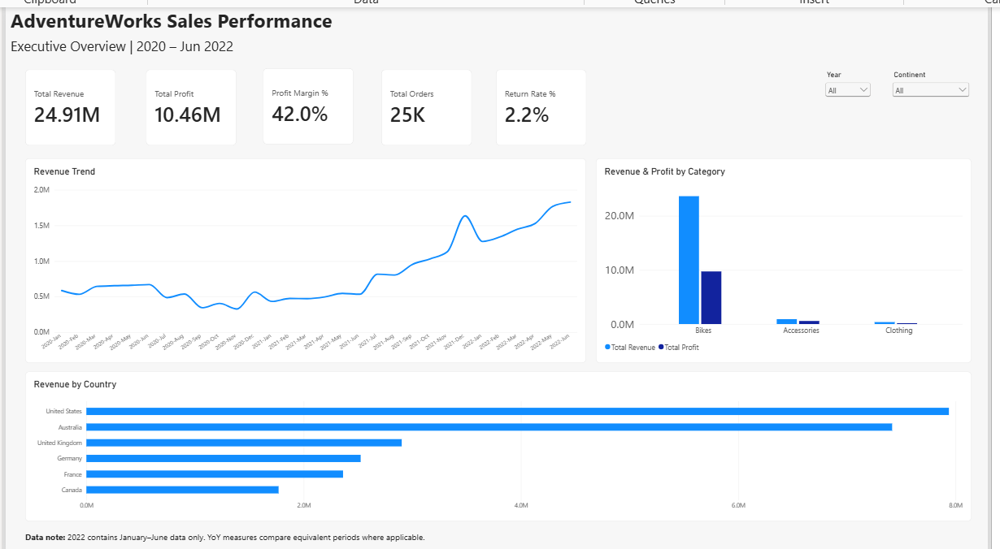
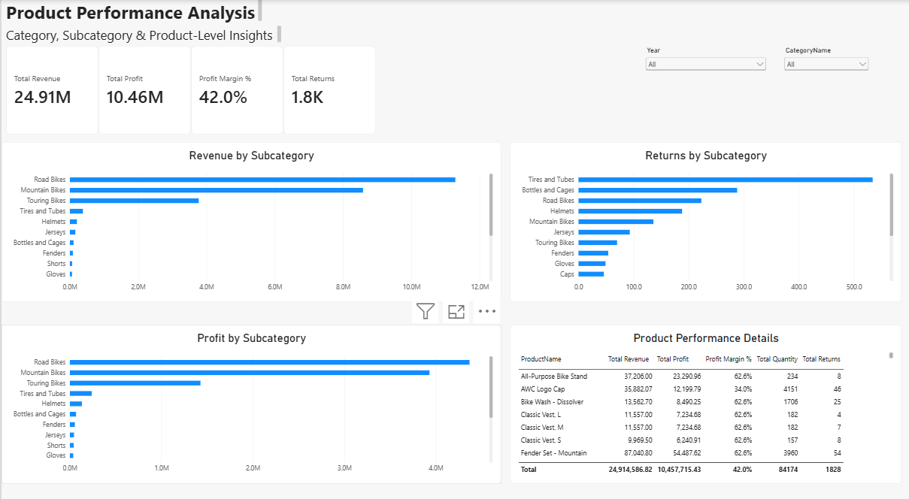
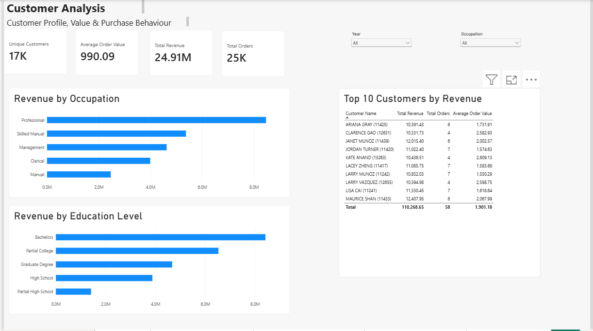
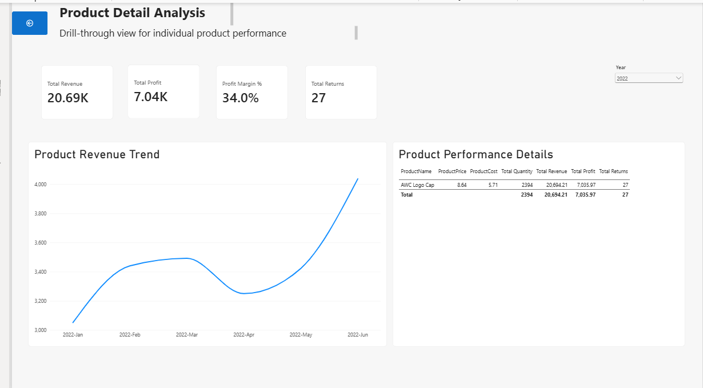

# AdventureWorks Sales Performance Analysis | Power BI

## Project Overview
This project is an end-to-end Power BI analysis of AdventureWorks sales data covering 2020 through June 2022. It was built entirely in Power BI Desktop and demonstrates Power Query, dimensional modeling, DAX, time intelligence, KPI reporting, slicers, interactive visuals, and product-level drill-through.

## Business Objective
Analyze revenue, profitability, orders, customers, products, returns, geography, and year-over-year performance, then present the results in a multi-page interactive Power BI report.

## Dataset
The project uses a multi-table AdventureWorks CSV dataset with Sales, Products, Product Categories, Product Subcategories, Customers, Territories, Returns, and Calendar tables.

The three annual sales files were appended into one Sales fact table containing **56,046 rows**.

See `documentation/dataset_source.md` for source details.

## Tools & Skills
- Power BI Desktop
- Power Query
- Data Profiling & Cleaning
- Star Schema / Data Modeling
- Relationship Management
- DAX
- Time Intelligence
- KPI Reporting
- Slicers
- Drill-through
- Interactive Report Design

## Data Preparation
- Profiled all tables using the entire dataset.
- Removed malformed/source-metadata rows from the Customers table.
- Retained valid customer rows with missing optional attributes.
- Final Customers table: **18,148 valid unique CustomerKeys**.
- Appended Sales 2020, Sales 2021, and Sales 2022 into one Sales fact table.
- Disabled model loading for annual staging sales queries.
- Final Sales table: **56,046 rows**, with no data errors.
- Marked the Calendar table as the official Date table.
- Added Year, Month, Month Number, Quarter, Year Month, and Year Month Sort fields.

## Data Model
The model uses Sales and Returns as fact-style tables with Calendar, Customers, Products, Product Subcategories, Product Categories, and Territories as supporting dimensions. Relationships were configured primarily as one-to-many with single-direction filtering.

## Core DAX Measures
Total Orders, Total Quantity, Total Revenue, Total Cost, Total Profit, Profit Margin %, Average Order Value, Unique Customers, Total Returns, Return Rate %, Previous Year Revenue, Revenue YoY %, YTD Revenue, Previous Year Profit, and Profit YoY %.

## Key KPIs
| KPI | Result |
|---|---:|
| Total Revenue | 24.91M |
| Total Profit | 10.46M |
| Profit Margin | 42.0% |
| Total Orders | ~25K |
| Return Rate | 2.2% |

## Time Intelligence Validation
- 2020 Revenue: ~6.40M
- 2021 Revenue: ~9.32M
- 2021 Revenue YoY growth: **45.6%**
- 2022 data covers **January through June only**
- 2022 Revenue YoY: **~211.1%**
- 2022 Profit YoY: **~210.6%**

2022 YoY measures compare Jan-Jun 2022 with Jan-Jun 2021 rather than using full-year 2021.

## Report Pages

### Executive Overview


Includes revenue, profit, profit margin, orders, return rate, revenue trend, category performance, country performance, and slicers.

### Product Performance


Includes revenue, profit, margin, returns, subcategory analysis, product-level detail, and year/category filtering.

### Customer Analysis


Includes unique customers, average order value, revenue, orders, occupation and education analysis, plus Top 10 customers by revenue.

### Product Detail Drill-through


Provides product-level drill-through for revenue, profit, margin, returns, monthly trend, unit price, unit cost, quantity, and product performance details.

## Key Findings
- Revenue increased materially from 2020 to 2021, with 2021 revenue approximately **45.6% higher** than 2020.
- Bikes are the dominant contributor to overall revenue and profit compared with the other product categories.
- The United States is the highest-revenue country in the report.
- Professional customers contribute the most revenue among the occupation groups analyzed.
- Graduate Degree customers lead revenue among the education segments shown.
- Product-level drill-through supports detailed investigation of profitability, returns, price, cost, quantity, and monthly performance.

## Business Recommendations
- Monitor the highest-revenue and highest-profit product categories and subcategories closely.
- Review high-return subcategories alongside sales performance to identify areas for deeper product-quality or return-pattern analysis.
- Use geographic performance to prioritize deeper market analysis.
- Use customer segment analysis for behavioral research without making unsupported assumptions about individual customers.
- Continue using like-for-like period comparisons when a year is incomplete.

## Data Limitation
**2022 contains January-June data only.** Full-year comparisons with 2021 would therefore be misleading.

## Repository Structure
```text
AdventureWorks-PowerBI-Analysis/
├── README.md
├── images/
│   ├── executive_overview.png
│   ├── product_performance.png
│   ├── customer_analysis.png
│   └── product_detail_drillthrough.png
├── documentation/
│   └── dataset_source.md
└── PowerBI/
    └── AdventureWorks_Sales_Performance_Analysis.pbix
```

If the PBIX file is too large for GitHub, omit the `PowerBI/` folder and keep the report screenshots and documentation.

## Project Workflow
**Raw CSVs → Profiling → Cleaning → Append Sales Tables → Star Schema → Calendar Setup → DAX → Time Intelligence Validation → Report Design → Drill-through → Final Validation**
